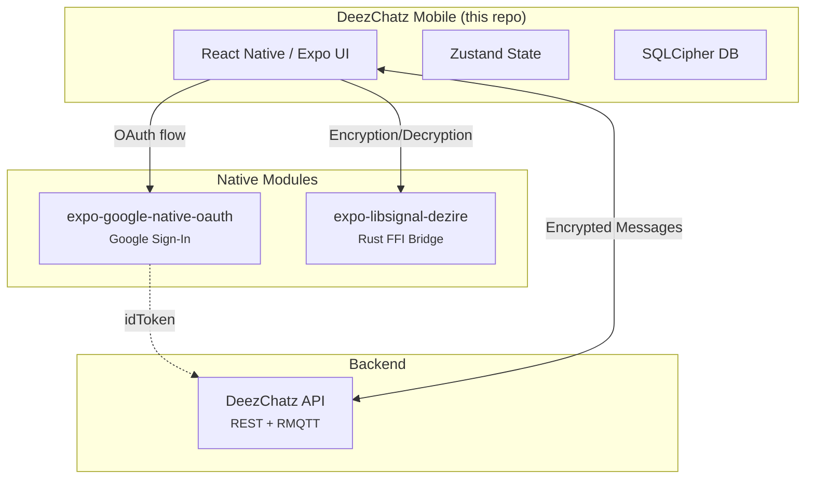

# Deez Chatz 💬

[](https://expo.dev)
[](https://reactnative.dev)
[](https://www.gnu.org/licenses/agpl-3.0)
[]()
[](https://signal.org/docs/)

**Deez Chatz** is a zero-trust, end-to-end encrypted messaging app built for fast, paranoid-level private communication. Ain't nobody reading Deez Chatz — not your ISP, not Big Tech, and definitely not our servers. Your messages belong to nobody but you and yours truly. Here at 'Deez', we don't hoard your data: storing useless logs costs real money and burns trees, and frankly... ain't nobody trying to pay servers to host your 3 AM chatzzz anyway 💬🔥

Built with ❤️ in **India**, for the **world**.

---

## Where This Fits

This repository is the actual app that users install. It is the top-level consumer in the Deez Chatz ecosystem:



---

## Features

### Current
- [x] One-to-one text messages with offline queueing and background sync
- [x] End-to-end encryption via Signal Protocol (X3DH + Double Ratchet)
- [x] Encrypted local storage (SQLCipher via `expo-sqlite`)
- [x] Contact syncing & bundle synchronization
- [x] Key change notifications & system message rendering
- [x] Dark & light theme support
- [x] Automated Jest unit testing suite

### Roadmap
- [ ] Voice notes
- [ ] File sharing
- [ ] Voice & video calls (WebRTC)
- [ ] Group chats (many-to-many messaging)
- [ ] Post-quantum security
- [ ] Multi-device support

---

## Tech Stack

| Layer | Technology |
|---|---|
| **Framework** | [Expo](https://expo.dev) (SDK 57) with [Expo Router](https://docs.expo.dev/router/introduction/) |
| **UI** | React Native 0.86, React 19.2 with Reanimated 4.5 animations |
| **State Management** | [Zustand](https://github.com/pmndrs/zustand) with SecureStore persistence |
| **Crypto** | [Signal Protocol](https://signal.org/docs/) — X3DH, Double Ratchet, VXEdDSA |
| **Native Crypto Module** | [expo-libsignal-dezire](https://github.com/deez-in/expo-libsignal-dezire) (Rust C-FFI native module) |
| **Auth Native Module** | [expo-google-native-oauth](https://github.com/deez-in/expo-google-native-oauth) |
| **Transport** | MQTT over TLS (via `expo-native-mqtt`) |
| **Local Database** | [expo-sqlite](https://docs.expo.dev/versions/latest/sdk/sqlite/) with SQLCipher encryption |
| **Secure Storage** | [expo-secure-store](https://docs.expo.dev/versions/latest/sdk/securestore/) for key material |
| **Testing** | Jest (`jest-expo`), React Native Testing Library |

---

## How Encryption Works in the App

All cryptographic operations are executed natively via `expo-libsignal-dezire`, which wraps the pure-Rust `libsignal-dezire` crate. At a high level:

1. **Key Generation**: On first launch, the app generates an Identity Key, a Signed Pre-Key, a Signed Device Key, and a batch of One-Time Pre-Keys locally.
2. **Registration**: The app signs these keys (VXEdDSA) and uploads them to the DeezChatz API.
3. **Session Establishment**: When you message someone for the first time, the app fetches their pre-key bundle from the server and performs an **X3DH** key agreement locally to derive a shared secret.
4. **Message Encryption**: Every message is encrypted using the **Double Ratchet** algorithm. A new key is derived for every single message, guaranteeing forward and backward secrecy.
5. **Storage**: The app stores message history locally in a SQLCipher encrypted database. The database encryption key is kept in the OS's Secure Enclave/Keystore.

*The server never has access to plaintext messages or your private keys.*

---

## Backend Infrastructure

The server-side infrastructure uses **RMQTT** as the MQTT broker, secured with TLS for all client connections. Messages are relayed in real-time over MQTT. The DeezChatz API also exposes a REST interface on port 3000 for registration and key discovery, and uses a private port 3001 to receive offline message webhooks from RMQTT for FCM push notifications.

> The backend is intentionally minimal by design. The broker acts as a dumb pipe — it routes encrypted blobs between clients and that's it. Your messages, your keys, your business 💬.

---

## Getting Started

### Prerequisites

- **Bun** — ([install from bun.sh](https://bun.sh))
- A physical device or emulator/simulator set up for development
- [Set up your development environment](https://docs.expo.dev/get-started/set-up-your-environment/) if this is your first time with Expo

> [!IMPORTANT]
> This project uses an **Expo development build** (not Expo Go). You will need to build a custom dev client before running the app.

### 1. Clone the repository

```bash
git clone https://github.com/deez-in/deezchatz-mobile.git
cd deezchatz-mobile
```

### 2. Install dependencies

```bash
bun install
```

### 3. Build & run the dev client

```bash
bun android    # Run on Android emulator/device
bun ios        # Run on iOS device
bun ios-sim    # Run on iOS simulator
bun start      # Start Expo development server
```

---

## Architecture

```text
src/
├── app/                  # Expo Router screens & layouts
│   ├── (tabs)/           # Tab-based navigation (home, settings)
│   ├── chat/             # Chat conversation screen
│   ├── register/         # User registration flow
│   └── _layout.tsx       # Root layout
├── components/           # Reusable UI components
│   ├── ChatBubble.tsx    # Message bubble
│   ├── OtpInput.tsx      # OTP verification input
│   ├── StyledButton.tsx  # Themed button
│   └── ...
├── hooks/                # Custom React hooks (theming, etc.)
├── store/                # Zustand state stores
├── utils/
│   ├── crypto/           # Signal protocol wrappers around expo-libsignal-dezire
│   ├── transport/        # MQTT client & messaging transport API
│   ├── storage/          # SQLite database layer (SQLCipher)
│   ├── messaging/        # Message encoding, send/receive handlers
│   └── helpers/          # Utility functions
├── assets/               # Images, fonts, and static assets
└── polyfills/            # Platform polyfills
```

---

## Testing

The project uses **Jest** with `jest-expo` and React Native Testing Library for unit testing.

```bash
# Run the unit test suite
bun run test
```

---

## CI/CD & Automated Builds

The repository includes GitHub Actions workflows (`.github/workflows/build-android.yml`) for automated APK and AAB generation and deployment:

- **Triggers**: On publishing a new GitHub release or via manual `workflow_dispatch`.
- **EAS Local Matrix Build**: Uses EAS CLI locally in GitHub Actions with a matrix strategy to build standalone Android APK and AAB binaries without requiring Expo cloud credits.
- **Play Store Deployment**: Automatically uploads the generated `.aab` to Google Play Store Internal Testing.
- **Artifacts & Releases**: Automatically attaches generated `.apk` and `.aab` binaries to GitHub Releases and uploads workflow build artifacts.

---

## Acknowledgements

This project stands on the shoulders of some incredible open-source work:

- **[Signal Protocol](https://signal.org/docs/)** — for pioneering the gold standard in end-to-end encryption
- **[Expo](https://expo.dev)** — for making cross-platform React Native development a joy
- **[RMQTT](https://rmqtt.io/)** — for a rock-solid, scalable MQTT broker
- **[Zustand](https://github.com/pmndrs/zustand)** — for delightfully simple state management
- **[expo-libsignal-dezire](https://github.com/deez-in/expo-libsignal-dezire)** — for native Rust Signal protocol FFI bindings

---

## License

This project is licensed under the **GNU Affero General Public License v3.0 (AGPLv3)** — see the [LICENSE](LICENSE) file for details.

**TL;DR:** You're free to use, modify, and distribute this software, but the source code must remain free and open source. If you run a modified version on a server, you must share the source. Because privacy should be everyone's right, not just a feature 🤫.
